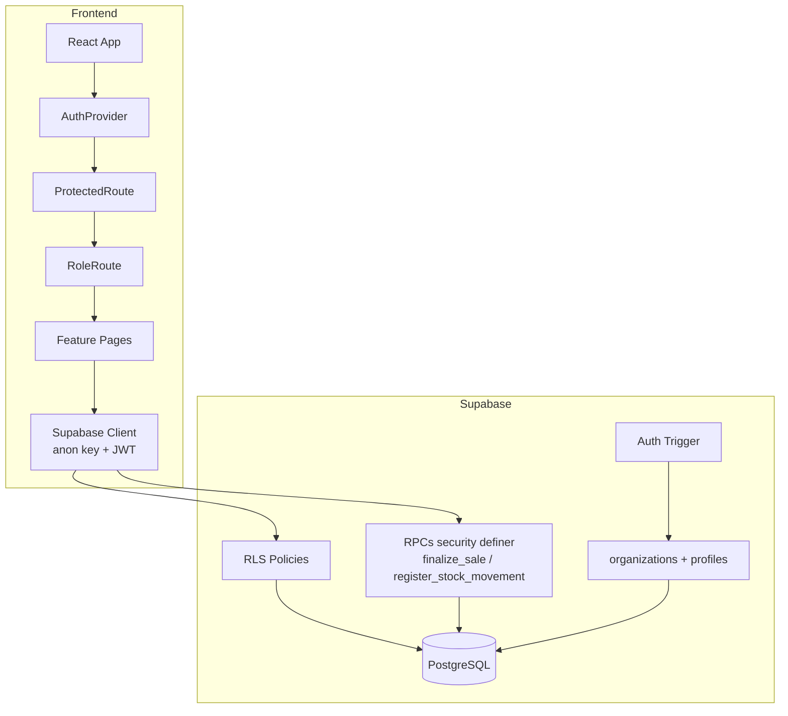

# RELATÓRIO RC1 — Cosmo Business AI

**Data:** 1 de agosto de 2026  
**Versão:** RC1 (Release Candidate 1)  
**Migration 009:** ✅ Aplicada com sucesso  
**Ambiente auditado:** Supabase + frontend React/Vite

---

## Resumo executivo

O RC1 introduz multi-tenant, Row Level Security (RLS), perfis de acesso (Administrador, Gerente, Caixa), auditoria e RPCs seguros. A migration 009 foi aplicada e os testes automatizados de RLS confirmam isolamento para acesso anônimo.

| Verificação | Resultado |
|-------------|-----------|
| `npm run build` | ✅ Passou (30s, sem erros TypeScript) |
| `npm run lint` | ✅ Passou (oxlint, zero issues) |
| `npm run validate:full` | ⚠️ Falhou — confirmação de e-mail bloqueia login automatizado |
| Auditoria RLS (`audit-rc1.mjs`) | ✅ 16/17 checks passaram |

**Bloqueio principal:** o Supabase exige confirmação de e-mail. O cadastro automatizado funciona, mas o login subsequente retorna `Email not confirmed`. Para validação CI/CD, configure `SUPABASE_TEST_EMAIL` / `SUPABASE_TEST_PASSWORD` no `.env` com um usuário já confirmado, ou desabilite temporariamente a confirmação de e-mail em **Authentication → Providers → Email**.

---

## 1. Arquitetura final

### Stack

| Camada | Tecnologia |
|--------|------------|
| Frontend | React 19, Vite 7, TypeScript 5.9 |
| UI | Tailwind CSS 4, shadcn/ui, Lucide |
| Backend | Supabase (PostgreSQL + Auth + RLS) |
| Roteamento | React Router 7 |

### Padrão de features

```
repository → service → hook → component → page
```

Cada módulo de negócio vive em `src/features/<modulo>/` com tipos, repositório, serviço, hooks e componentes isolados.

### Módulos implementados

| Módulo | Rota | Camadas |
|--------|------|---------|
| Auth | `/login` | Provider, context, ProtectedRoute, RoleRoute, GuestRoute |
| Dashboard | `/` | repository, hooks, charts, insights |
| Produtos | `/produtos` | CRUD completo, busca, stats |
| Estoque | `/estoque` | movimentações, alertas, RPC `register_stock_movement` |
| PDV | `/pdv` | carrinho, checkout, RPC `finalize_sale` |
| Clientes | `/clientes` | CRUD, paginação, histórico de compras |
| Financeiro | `/financeiro` | transações, relatórios, exportação |
| Pedidos | `/pedidos` | stub |
| Cosmo AI | `/ia` | stub |
| Configurações | `/configuracoes` | stub (admin only) |

### Banco de dados (migrations 001–009)

```
001 products
002 sales + sale_items + sale_payments + finalize_sale
003 discount + observation
004 stock_movements + register_stock_movement
005 customers
006 financial_transactions
007 customer_id + cpf + finalize_sale com cliente
008 fix finalize_sale overload
009 RC1 — organizations, profiles, audit_logs, RLS, RPCs seguros
```

### Diagrama de fluxo RC1



### Infraestrutura transversal

- `ErrorBoundary` global em `App.tsx`
- Logger estruturado em `src/lib/logger.ts`
- Tratamento de erros em `src/lib/errors.ts`
- Validação de env em `src/config/supabase.ts`
- Scripts de validação em `scripts/`

---

## 2. Segurança

### 2.1 Row Level Security (RLS)

Migration 009 habilita RLS em **10 tabelas**:

| Tabela | RLS | Políticas |
|--------|-----|-----------|
| `organizations` | ✅ | SELECT própria org |
| `profiles` | ✅ | SELECT org; UPDATE admin |
| `audit_logs` | ✅ | SELECT admin/manager |
| `products` | ✅ | CRUD admin/manager; SELECT org |
| `customers` | ✅ | CRUD admin/manager; SELECT org |
| `sales` | ✅ | SELECT admin/manager/cashier |
| `sale_items` | ✅ | SELECT via sales |
| `sale_payments` | ✅ | SELECT via sales |
| `stock_movements` | ✅ | SELECT admin/manager |
| `financial_transactions` | ✅ | SELECT/INSERT/DELETE admin/manager |

**Teste automatizado (anônimo):** todas as 10 tabelas retornam **0 linhas** em SELECT sem JWT. INSERT anônimo em `products` é rejeitado com *"Usuário sem organização vinculada"* (trigger + RLS).

### 2.2 Isolamento entre organizações

- Coluna `organization_id` em todas as tabelas de negócio (NOT NULL após backfill)
- Função `get_my_organization_id()` lê perfil do usuário autenticado
- Policies filtram por `organization_id = get_my_organization_id()`
- RPCs validam org e role antes de executar
- Trigger `set_row_organization_id` impede inserção em org alheia
- Backfill migrou dados existentes para **"Organização Padrão"**

**Teste cross-org:** pendente de usuário autenticado confirmado (ver seção de pendências).

### 2.3 Perfis e permissões

| Papel | Label | Rotas permitidas |
|-------|-------|------------------|
| `admin` | Administrador | Todas |
| `manager` | Gerente | Todas exceto `/configuracoes` |
| `cashier` | Caixa | `/pdv`, `/clientes` (leitura) |

Implementação:

- `ROUTE_PERMISSIONS` em `src/features/auth/types/roles.ts`
- `RoleRoute` redireciona para rota padrão do papel
- `Sidebar` filtra menu com `canAccessRoute()`
- RLS no banco reforça permissões (ex.: caixa não vê financeiro)

| Recurso DB | Admin | Gerente | Caixa |
|------------|-------|---------|-------|
| Dashboard/agregações | ✅ | ✅ | ❌ (RLS sales) |
| Produtos CRUD | ✅ | ✅ | ❌ |
| Estoque | ✅ | ✅ | ❌ |
| PDV / Vendas | ✅ | ✅ | ✅ |
| Clientes CRUD | ✅ | ✅ | 👁️ SELECT |
| Financeiro | ✅ | ✅ | ❌ |
| Audit logs | ✅ | ✅ | ❌ |
| Configurações (UI) | ✅ | ❌ | ❌ |

### 2.4 Autenticação

| Funcionalidade | Status | Detalhe |
|----------------|--------|---------|
| Login e-mail/senha | ✅ | `authService.signIn` |
| Cadastro | ✅ | Envia `company_name` + `full_name` nos metadados |
| Google OAuth | ✅ | Configurável no Supabase |
| Recuperação de senha | ✅ | `GuestRoute` permite `?mode=reset` |
| Logout | ✅ | Limpa sessão e perfil |
| Sessão persistente | ✅ | `persistSession: true`, refresh automático |
| Trigger signup | ✅ | Cria org + perfil admin via `handle_new_user` |

### 2.5 Rotas protegidas

Todas as rotas de negócio usam `ProtectedPage` = `ProtectedRoute` + `RoleRoute`:

| Rota | Auth | Role |
|------|------|------|
| `/login` | Guest only | — |
| `/`, `/produtos`, `/estoque`, `/financeiro`, `/pedidos`, `/ia` | ✅ | admin, manager |
| `/pdv`, `/clientes` | ✅ | admin, manager, cashier |
| `/configuracoes` | ✅ | admin |
| `*` | Redirect → `/` | — |

Sem JWT: redireciona para `/login`.  
Com JWT sem perfil: tela *"Perfil não configurado"*.

### 2.6 RPCs seguras

| RPC | Roles | Validações |
|-----|-------|------------|
| `finalize_sale` | admin, manager, cashier | org, estoque, pagamento, cliente, auditoria |
| `register_stock_movement` | admin, manager | org, estoque, auditoria |

Funções auxiliares (`get_my_organization_id`, `get_my_role`, `has_role`, `log_audit`) são `SECURITY DEFINER` com `search_path = public`. Execução revogada de `public`, concedida a `authenticated`.

### 2.7 Auditoria

Tabela `audit_logs` registra ações como `auth.signup`, `sale.completed`, `stock.movement` via `log_audit()`. Visível apenas para admin e manager.

### 2.8 Achado de segurança — overload `finalize_sale`

Ao chamar `finalize_sale` com apenas 3 parâmetros, o PostgreSQL retorna ambiguidade entre duas assinaturas:

- `(jsonb, text, numeric)` — migration 002
- `(jsonb, text, numeric, numeric, text, uuid)` — migration 009

**Impacto:** o frontend sempre envia os 6 parâmetros (`pdv.repository.ts`), então o PDV em produção **não é afetado**. Scripts de validação que omitem parâmetros opcionais podem falhar.

**Recomendação:** migration `010` para `DROP FUNCTION finalize_sale(jsonb, text, numeric)`.

---

## 3. Performance

### Build de produção

| Métrica | Valor |
|---------|-------|
| Tempo de build | ~30s |
| Módulos transformados | 2.682 |
| Bundle principal (gzip) | 479 KB |
| CSS (gzip) | 12 KB |
| Aviso Vite | Chunk > 500 KB — considerar code-splitting |

### Banco de dados

- Índices em `organization_id` em todas as tabelas tenant
- Índices em `profiles(user_id)`, `audit_logs(created_at desc)`
- RPCs usam `FOR UPDATE` para consistência de estoque (serialização por produto)
- RLS adiciona filtro por org em cada query — impacto mínimo com índices

### Frontend

- Queries via Supabase client (sem N+1 evidente nos repositórios)
- Dashboard agrega em queries paralelas (`Promise.all`)
- Paginação de clientes no servidor (`range`)

### Recomendações pós-RC1

1. Code-splitting de rotas (`React.lazy`) para reduzir bundle inicial
2. Monitoramento com Sentry ou similar
3. Connection pooling via Supabase (já gerenciado)
4. Revisar queries do dashboard com volume alto de vendas

---

## 4. Cobertura dos módulos

### Resultados da validação

| Módulo | Código | Teste automatizado | Observação |
|--------|--------|-------------------|------------|
| Login | ✅ | ⚠️ | Bloqueado por confirmação de e-mail |
| Cadastro + org automática | ✅ | ⚠️ | Signup OK; login pós-signup falha |
| Perfis (3 roles) | ✅ | ⚠️ | RLS/UI implementados; teste manual pendente |
| RLS (10 tabelas) | ✅ | ✅ | 10/10 SELECT anônimo vazio |
| Isolamento org | ✅ | ⚠️ | Requer 2 usuários confirmados |
| CRUD Produtos | ✅ | ⚠️ | Trigger bloqueia anônimo (esperado) |
| CRUD Clientes | ✅ | ⚠️ | Idem |
| PDV | ✅ | ⚠️ | Frontend passa 6 params; RPC OK |
| Estoque | ✅ | ⚠️ | RPC com checagem de role |
| Financeiro | ✅ | ⚠️ | Integrado ao PDV |
| Dashboard | ✅ | ⚠️ | Agregações via sales/customers/finance |

### Detalhamento por feature

**Auth** — Provider, context, forms (login, signup, forgot/reset password), Google OAuth, profile loading com org.

**Produtos** — Listagem, busca, stats, modal CRUD, delete dialog, imagem (campo preparado, upload não implementado).

**Clientes** — CRUD, CPF, paginação, stats, histórico de compras, seletor no PDV.

**PDV** — Grid de produtos, carrinho, desconto, observação, formas de pagamento, cliente opcional, RPC atômica.

**Estoque** — Movimentações entry/exit, alertas de estoque mínimo, histórico.

**Financeiro** — Transações manuais, relatórios, export PDF/XLSX, integração automática com PDV.

**Dashboard** — Vendas, top produtos, top clientes, resumo financeiro, insights.

**Stubs** — Pedidos, Cosmo AI, Configurações (sem funcionalidade).

---

## 5. Checklist de produção

### Banco de dados

- [x] Migrations 001–009 aplicadas
- [x] RLS habilitado em 10 tabelas
- [x] Trigger `on_auth_user_created` ativo
- [x] Backfill para "Organização Padrão"
- [ ] Migration 010 — remover overload `finalize_sale` (recomendado)

### Supabase Auth

- [ ] Site URL e Redirect URLs de produção configurados
- [ ] Google OAuth configurado (se usado)
- [x] Confirmação de e-mail habilitada (bloqueia CI; correto para produção)
- [ ] Templates de e-mail personalizados

### Variáveis de ambiente

- [x] `VITE_SUPABASE_URL`
- [x] `VITE_SUPABASE_PUBLISHABLE_KEY`
- [ ] `SUPABASE_TEST_EMAIL` / `SUPABASE_TEST_PASSWORD` (opcional, para CI)
- [x] Service role **não** exposta no frontend

### Build e qualidade

- [x] `npm run build` — OK
- [x] `npm run lint` — OK
- [ ] `npm run validate:full` — requer usuário confirmado

### Segurança RC1

- [x] RLS ativo
- [x] Perfis admin/manager/cashier
- [x] Rotas protegidas (auth + role)
- [x] RPCs com org/role
- [x] Auditoria em `audit_logs`
- [x] Acesso anônimo bloqueado (testado)
- [ ] Teste manual cross-org com 2 contas
- [ ] Teste manual caixa → `/financeiro` → redirect

### Deploy

- [ ] Deploy frontend (Vercel/Netlify)
- [ ] Variáveis no painel do host
- [ ] CSP / security headers no host
- [ ] Backups Supabase (Pro plan)
- [ ] Monitoramento de erros (Sentry)

### Pós-deploy manual

- [ ] Login com conta real
- [ ] Cadastro cria org + perfil admin
- [ ] PDV → venda → estoque → financeiro → dashboard
- [ ] Logout e re-login com sessão persistida

---

## 6. Pendências antes da versão 1.0

### Críticas (bloqueiam 1.0)

| # | Item | Prioridade |
|---|------|------------|
| 1 | Migration 010 — drop overload `finalize_sale(jsonb, text, numeric)` | Alta |
| 2 | Validar fluxo autenticado end-to-end (`validate:full` passando) | Alta |
| 3 | Teste manual de isolamento entre 2 organizações | Alta |

### Importantes (RC1 → 1.0)

| # | Item |
|---|------|
| 4 | UI de convite de usuários para mesma organização |
| 5 | UI de gerenciamento de roles em `/configuracoes` |
| 6 | Caixa: policy de clientes — hoje SELECT permitido, INSERT/UPDATE bloqueado no RLS (alinhado?) |
| 7 | Code-splitting para bundle < 500 KB |
| 8 | Upload de imagem de produto |
| 9 | Módulo Pedidos (atualmente stub) |
| 10 | Módulo Cosmo AI (stub) |
| 11 | Testes unitários automatizados |
| 12 | Sentry / observabilidade |
| 13 | CSP e security headers no deploy |

### Configuração recomendada para destravar CI

Adicionar ao `.env` (não commitar):

```env
SUPABASE_TEST_EMAIL=seu-admin@empresa.com
SUPABASE_TEST_PASSWORD=senha-do-usuario-confirmado
```

Ou em **Supabase Dashboard → Authentication → Providers → Email**, desabilitar *"Confirm email"* apenas no ambiente de staging/CI.

---

## Comandos executados nesta auditoria

```bash
npm run validate:full   # FALHOU — Email not confirmed
npm run build           # OK
npm run lint            # OK
node scripts/audit-rc1.mjs  # 16/17 OK (RLS + infra)
node scripts/validate-system.mjs  # FALHOU — Usuário sem organização (RLS funcionando)
```

---

## Conclusão

O RC1 está **estruturalmente pronto** para produção multi-tenant: migration 009 aplicada, RLS validado em todas as tabelas, rotas e permissões implementadas no frontend e no banco, build e lint limpos.

O principal gap é a **validação do fluxo autenticado completo**, bloqueada pela confirmação de e-mail do Supabase. Com um usuário confirmado (ou credenciais de teste no `.env`), `npm run validate:full` deve validar CRUD, PDV, estoque, financeiro, dashboard e auditoria em sequência.

Recomenda-se aplicar migration 010 para eliminar o overload residual de `finalize_sale` antes do deploy final.

**Status RC1:** ✅ Aprovado com ressalvas — pronto para deploy controlado após testes manuais com usuário confirmado.
